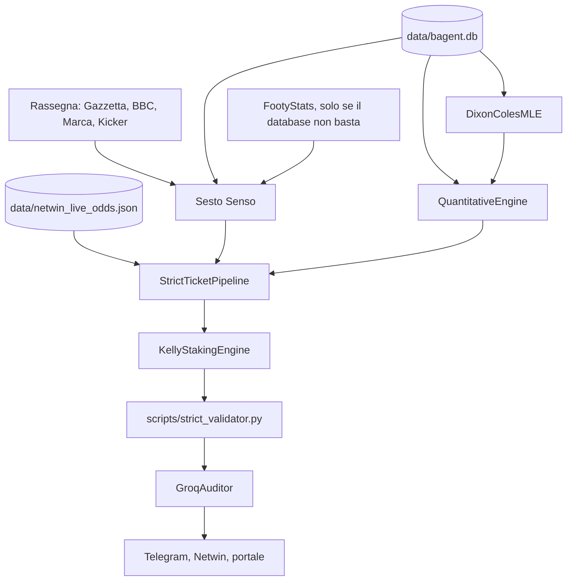
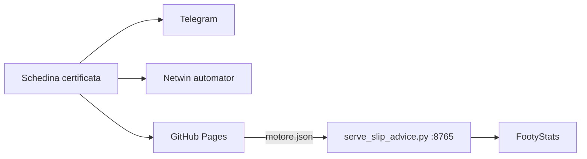

# Architettura di BAgent

Stato del codice al 1 ottobre 2026. Questo documento descrive il percorso che produce una schedina. `01_System.md`, `Project_Structure.md` e `ADR-001` descrivono un layering domain / application / infrastructure / app. Quelle cartelle esistono, ma il percorso operativo sta in `services/` e `scripts/`.

BAgent è un agente di calcio quantitativo. Le probabilità vengono dallo storico dei gol e da un modello di Poisson, non dalle quote. L'edge, `(probabilità × quota) − 1`, è un avviso. Il tennis è fuori dal perimetro dal 22 settembre 2026.

## Flusso di una schedina

Una selezione entra in `MarketCandidate`: partita, mercato, quota, xG, calcio d'inizio con data e ora, testo del Sesto Senso. `StrictTicketPipeline.validate_candidate` applica i gate in ordine. `validate_ticket` aggiunge il tetto di 3-4 selezioni, lo stake e l'audit Groq. Senza `strict_validator.py` e senza l'audit la schedina non si propone come giocabile. L'audit non ribalta il verdetto del validatore.

## Due sorgenti, e il resto

La Regola #79 fissa i due file su cui si calcola una Hidden Gem.

| File | Cosa contiene | Chi lo scrive |
| --- | --- | --- |
| `data/bagent.db` | Gol della stagione, xG, partite `status = 'FT'` | Import FootyStats e aggiornatori in `scripts/` |
| `data/netwin_live_odds.json` | Quote reali, compresi MultiGol, Chance Mix, combo | Scraper Netwin, prima del palinsesto |

Lo snapshot delle quote non si usa se ha più di qualche ora. Una squadra del palinsesto deve avere il nome agganciato allo storico, tramite alias e normalizzazione. Senza aggancio la partita non si pubblica.

FootyStats, Flashscore, Sofascore e la rassegna stampa integrano. Non sostituiscono i due file. `serve_slip_advice.py` è l'eccezione: il form del portale chiama FootyStats a ogni richiesta.

## Motore

Tre stimatori convivono. Non sono lo stesso oggetto.

`services/analysis/dixon_coles_mle.py` (`DixonColesMLE`) stima dal database i parametri del paper del 1997: attacco, difesa, fattore campo, ρ. Il fit è non vincolato, con l'ultima squadra codificata a −1 nella matrice di design. Il peso temporale è `exp(−0.0019 · giorni)`. Gli attacchi pubblicati hanno media aritmetica 1. Una squadra con poche partite viene tirata verso 1 con `N / (N + 3)`.

`services/analysis/xg_poisson_engine.py` (`QuantitativeEngine`) prezza un mercato già dato un xG di casa e uno di trasferta. I gol usano Dixon-Coles con ρ di default `−0.05`. I corner usano una binomiale negativa. Il primo tempo usa lo stesso Poisson su xG × 0.45. Questa è la funzione che la pipeline chiama in fase 5.

`services/football/base_model/goal_model.py` è la stima euristica `gol fatti / media di lega`. La usa ancora il Sesto Senso. Non è il certificato della pipeline.

Lo stake esce da `services/betting/kelly_staking_engine.py`: Kelly frazionario, tetto 8% del bankroll sul ticket. L'edge sotto +4% e la probabilità sotto 72% restano avvisi, non bocciature.

## Decisione

`services/betting/strict_ticket_pipeline.py` è il funnel. I rifiuti che contano, in ordine:

1. Data e ora del calcio d'inizio, Regola #76. Un kickoff nel passato o senza orario esce.
2. Niente 1 o 2 secco sotto 1.65. Si sostituisce con doppia chance, DNB o MultiGol.
3. Regola #80: niente Under stretto e niente esito della sfavorita se la favorita è sotto 1.35, o se è una corazzata in casa.
4. Regola #56: niente seconde divisioni e squadre riserve.
5. Niente 2 o X2 in trasferta nelle coppe, in Turchia, Grecia e Balcani.
6. Corner solo con almeno 18 tiri di media. Niente Over corner di squadra alto su una favorita da goleada rapida.
7. Niente tetto MultiGol 1-3 su un attacco dominante. Niente Over 1.5 imposto su un corto muso.
8. DNA di lega in `league_dna_market_matcher.py`. Il semaforo rosso boccia.
9. Senza xG, e senza uno storico minimo, la Regola #55 blocca. Con xG la fonte è già verificata.
10. Rosa, infortuni e distinta solo se la selezione nomina un giocatore.
11. Il testo del Sesto Senso è obbligatorio. Le bandiere di turnover, avvio lento e bassa motivazione possono bocciare.
12. La probabilità arriva dal motore. Se il mercato non è mappato, la selezione esce.

`scripts/strict_validator.py` è il certificato da riga di comando sugli stessi gate. Il verdetto in chat è lo stato di quello script: stella se l'edge è almeno +5%, occhio se è positivo sotto il 5%, croce se è negativo.

`services/debate/groq_auditor.py` manda la schedina a Groq Cloud, modello `openai/gpt-oss-120b`, a costo zero. Cerca la trappola del bookmaker, lo scenario di perdita e lo stake. È il ciclo della Regola #77. Non sostituisce il validatore.

## Uscite

`services/betting/certified_ticket_publisher.py` manda il ticket a Telegram e prepara la selezione per l'automazione Netwin. Il portale statico è `portal/`: `schedine.json` è il palinsesto già scritto, `schedine.html` lo mostra e, per una richiesta nuova, legge `advice_url` da `motore.json` e fa POST su `/api/schedina`. Quel file oggi punta a un quick tunnel Cloudflare, che cambia hostname a ogni riavvio. Il motore locale ascolta la porta 8765. Gli script di tunnel aperti verso 8088 o 8443 non lo raggiungono.

## Live

Il minuto e il punteggio arrivano da Flashscore (`FlashscoreLiveEngine`), non da `adesso − calcio d'inizio`. I trigger stanno in `services/live/`: assedio se la sfavorita passa avanti, pressione nel finale, 0-0 all'intervallo con volume, gol precoce, quattro cartellini già usciti. Lo stake live resta entro il 3% del bankroll. Una partita già iniziata non entra nel ticket pre-match.

## Harness

`harness/` non è un secondo motore. È la rete che rilancia le regole su giornate congelate.

| Pezzo | Ruolo |
| --- | --- |
| `harness/contracts.py` | Per ogni regola, una selezione che il funnel deve fermare e una che deve passare |
| `harness/replay.py` | Legge uno slate JSON e chiama la pipeline senza rete e senza il database |
| `harness/calibration.py` | Brier, bin di affidabilità, curva di cassa con il Kelly |
| `harness/cassettes/` | Nastro HTTP di FootyStats, per i test del client |
| `tests/harness/` | Pytest. Hypothesis copre quote, orario e tetto di stake |

`python -m harness` stampa il report di calibrazione su `harness/slates/settled_smoke.json`. Non entra nel ciclo di emissione e non chiama Groq.

## Mappa del repository

| Cartella | Ruolo nel sistema che gira |
| --- | --- |
| `services/analysis` | Poisson, Dixon-Coles, DNA di lega, combo |
| `services/betting` | Pipeline, Kelly, cache e automazione Netwin |
| `services/football` | Sesto Senso, rosa, client esterni |
| `services/debate` | Audit Groq |
| `services/portal` | Consigli e archivio per la pagina |
| `services/live` | Trigger in-play |
| `services/telegram` | Invio dei ticket |
| `scripts` | Validatore, scraper, server del portale, import |
| `harness` | Contratti, replay, calibrazione |
| `data` | `bagent.db` e `netwin_live_odds.json` |
| `portal` | Pagine statiche pubblicate su GitHub Pages |
| `tests` | Pytest, compresi i contratti del harness |
| `domain`, `application`, `infrastructure`, `app` | Layering previsto dall'ADR-001. Non è il percorso della schedina |

## Confini

Si gioca sulle prime divisioni con telemetria e sulle coppe UEFA tra quelle squadre. Sotto le 3 partite chiuse è un avviso: l'xG è lo shrinkage sulla media di lega. Senza database e senza FootyStats la partita si scarta.

Le quote di tabella possono arrivare da API-Football o The Odds API. Il numero che si gioca si verifica su Netwin. Se l'aggio porta l'edge sotto +4%, il gate lo segnala e non blocca.

Il perimetro di una modifica al motore è questo documento: un parametro nuovo entra in `DixonColesMLE` o in `QuantitativeEngine`, poi deve passare il funnel e il harness prima di arrivare a Telegram o al portale.
